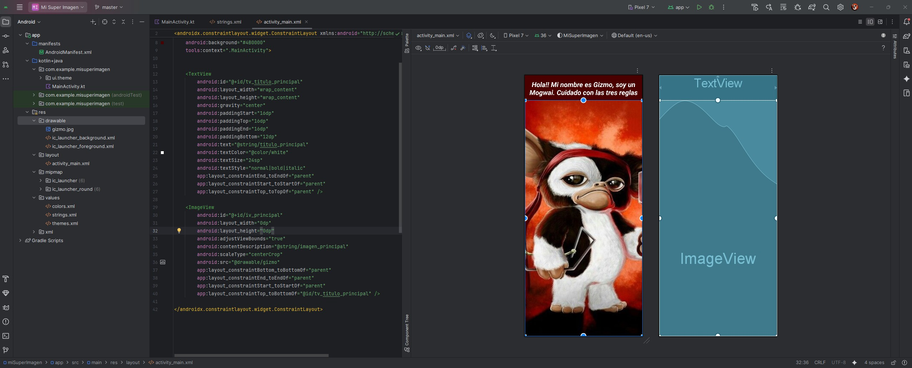
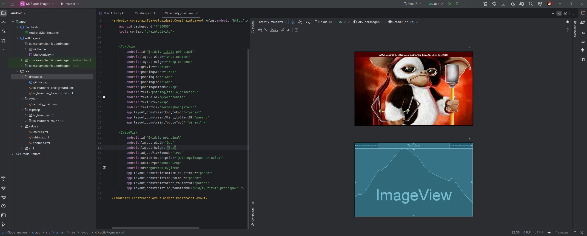
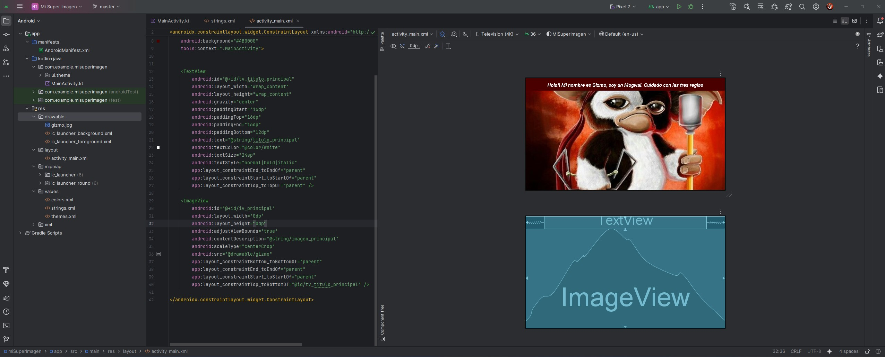

**_<h1 align="center">:vulcan_salute: Proyecto Realizado con Andoid Studio - Mi Super Imagen ABP1_AE4:computer:</h1>_**

**<h3>:blue_book: Contexto de la Actividad:</h3>**

<p>El ecosistema Android abarca una amplia variedad de dispositivos con distintos tamaños y
resoluciones de pantalla. Por ello, una aplicación bien diseñada debe ser capaz de adaptar
correctamente sus elementos visuales, especialmente las imágenes, para asegurar una experiencia de
usuario consistente en cualquier dispositivo.</p>
<p>El manejo adecuado del escalado y posicionamiento de imágenes es un aspecto fundamental en el
diseño de interfaces responsivas dentro del desarrollo Android moderno.</p>

**<h3>:blue_book: Objetivo:</h3>**

<p>Diseñar e implementar una aplicación Android simple que utilice bibliotecas AndroidX, en la que
se integre un título de texto y una imagen central de gran tamaño, verificando que se visualicen
adecuadamente en diferentes tamaños de pantalla mediante el uso de buenas prácticas de diseño responsivo.</p>

**<h3>:orange_book: Requerimiento Técnico:</h3>**

1. Crear un nuevo proyecto Android en Android Studio con las siguientes características:
- Tipo de proyecto: Empty Activity
- Nombre del proyecto: Mi Super Imagen
- Package name: com.example.misuperimagen
- Lenguaje: Java
- SDK mínimo: API 21
- No seleccionar la opción de bibliotecas legacy (android.support); se deben utilizar exclusivamente bibliotecas AndroidX

2. Implementar una interfaz en el archivo activity_main.xml que contenga:
- Un componente TextView en la parte superior con un título representativo
- Un componente ImageView debajo del texto, que contenga una imagen grande y que se adapte correctamente a distintos tamaños de pantalla utilizando atributos como:
- * scaleType="centerCrop" o fitCenter
- * layout_width="match_parent"
- * layout_height="0dp" con layout_weight, si se usa LinearLayout
- * Uso de ConstraintLayout para diseño responsivo (recomendado)

3. Probar la aplicación en un emulador Android con resolución diferente a la de desarrollo (por ejemplo, Pixel 4 o similar), asegurando que la imagen:
- No se distorsione
- Se escale correctamente
- Mantenga su relación de aspecto

4. Tomar capturas de pantalla de la app en ejecución donde se aprecie el título y la imagen correctamente renderizados.

**<h3>📁 Estructura del Proyecto Android:</h3>**

```Android
📘 README.md
📁 app
├── 📁 manifests
│   └── 🟧 AndroidManifest.xml
├── 📁 kotlin + java
│   ├── 📁 cl.bootcamp.misuperimagen (main)
│   │   ├── 🟦 ui.theme
│   │   └── 🟦 MainActivity.java
│   ├── 📁 cl.bootcamp.misuperimagen (android Test)
│   │   └── 🟦 ExampleInstrumentedTest.java
│   └── 📁 cl.bootcamp.misuperimagen (test)
│       └── 🟦 ExampleUnitTest.java
├── 📁 res
│   ├── 📁 drawable
│   │   │    ├── 🖼️ gizmo.jpg
│   │   │    ├── 🖼️ tablet_nexus_10
│   │   │    ├── 🖼️ telefono_pixel_7
│   │   │    ├── 🖼️ television_4k
│   │   │    ├── 🟧 ic_launcher_background.xml
│   │   │    └── 🟧 ic_launcher_foreground.xml
│   ├── 📁 layout
│   │   └── 📁 activity_main.xml
│   ├── 📁 mipmap
│   │   ├── 📁 ic_launcher
│   │   └── 📁 ic_launcher_round
│   ├── 📁 values
│   │   ├── 🟧 themes.xml
│   │   ├── 🟧 colors.xml
│   │   └── 🟧 strings.xml
│   └── 📁 xml
📁 Gradle Scripts
├── 🟦 build.gradle.kts (Project: misuperimagen)
├── 🟦 build.gradle.kts (Module: app)
├── 🟦 proguard-rules.pro (ProGuard rules for ":app")
├── 🟦 gradle.properties (Project properties)
├── 🟦 gradle-wrapper.properties (Gradle Version)
├── 🟦 libs.versions.toml (version Catalog "libs")
├── 🟦 local.properties (SDK Location)
└── 🟦 settings.gradle.kts (Project Settings)
```

**<h3>:book: Imagen general del proyecto en tres tipos de pantalla:</h3>**


<br>

<br>
